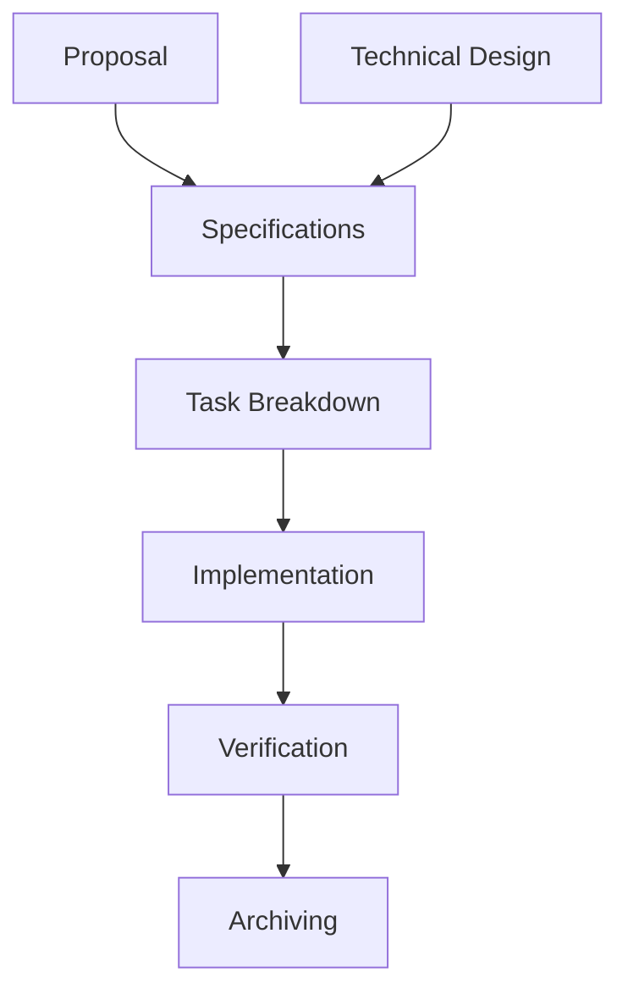

# Single Agent SDD Orchestrator for Antigravity

This rule defines how the agent should manage substantial changes using Spec-Driven Development (SDD) in single agent mode. All tasks, from exploration to verification, are handled directly by the primary agent.

## Core Principles

1. **Self-Contained Execution**: You are the researcher, designer, and executor. Follow the SDD phases sequentially.
2. **Context Management**: Use artifacts (engram or local files) to maintain state across steps and prevent context bloat.
3. **Evidence-Based Success**: Every change must be backed by a proposal, verified against specs, and validated with tests.
4. **No Delegation**: Perform all work inline using your available tools. Do not attempt to launch sub-agents.

---

## SDD Workflow (Spec-Driven Development)

SDD is the structured planning layer for substantial changes.

### Artifact Store Policy

| Mode       | Behavior                                                                 |
| ---------- | ------------------------------------------------------------------------ |
| `engram`   | Default when available. Persistent memory across sessions.               |
| `openspec` | File-based artifacts. Use only when user explicitly requests.            |
| `hybrid`   | Both backends. Cross-session recovery + local files. More tokens per op. |
| `none`     | Return results inline only. Recommend enabling engram or openspec.       |

### Commands
- `/sdd-init` -> run `sdd-init` skill
- `/sdd-explore <topic>` -> run `sdd-explore` skill
- `/sdd-new <change>` -> run `sdd-explore` then `sdd-propose` skills
- `/sdd-continue [change]` -> identify and execute the next missing phase in the dependency chain
- `/sdd-ff [change]` -> execute all pending phases sequentially: `propose` -> `spec` -> `design` -> `tasks`
- `/sdd-apply [change]` -> execute `sdd-apply` skill in batches
- `/sdd-verify [change]` -> execute `sdd-verify` skill
- `/sdd-archive [change]` -> execute `sdd-archive` skill

### Dependency Graph

### Result Contract
After completing each phase, summarize: `status`, `summary of findings/changes`, `artifacts created`, `risks identified`, and `next step`.

---

## Technical Guidelines for Single Agent

### Context and Memory
- **Read**: Before starting a phase, check for previous relevant artifacts using `mem_search` or by reading the `openspec/` directory.
- **Write**: Use `mem_save` or `write_to_file` to persist discoveries, decisions, and progress at the end of every significant step.
- **Topic Keys**: Organize engram observations using the standard format: `sdd/{change-name}/{phase}`.

### Persistence Format (Engram)

| Artifact        | Topic Key                          |
| --------------- | ---------------------------------- |
| Project context | `sdd-init/{project}`               |
| Exploration     | `sdd/{change-name}/explore`        |
| Proposal        | `sdd/{change-name}/proposal`       |
| Spec            | `sdd/{change-name}/spec`           |
| Design          | `sdd/{change-name}/design`         |
| Tasks           | `sdd/{change-name}/tasks`          |
| Apply progress  | `sdd/{change-name}/apply-progress` |
| Verify report   | `sdd/{change-name}/verify-report`  |
| Archive report  | `sdd/{change-name}/archive-report` |
| DAG state       | `sdd/{change-name}/state`          |

### Hard Stop & Verification
- **Never Skip Phases**: Do not skip planning (Proposal/Spec/Design) for non-trivial changes.
- **Manual Check**: Before moving from `tasks` to `apply`, confirm the task list is complete.
- **Proof of Work**: Use `sdd-verify` to provide evidence (terminal logs, test results) that the implementation matches the specs.

### Recovery Rule
If context is lost or a session restarts, recover state by searching for the `sdd/{change-name}/state` topic key or checking the `openspec/` file structure.
